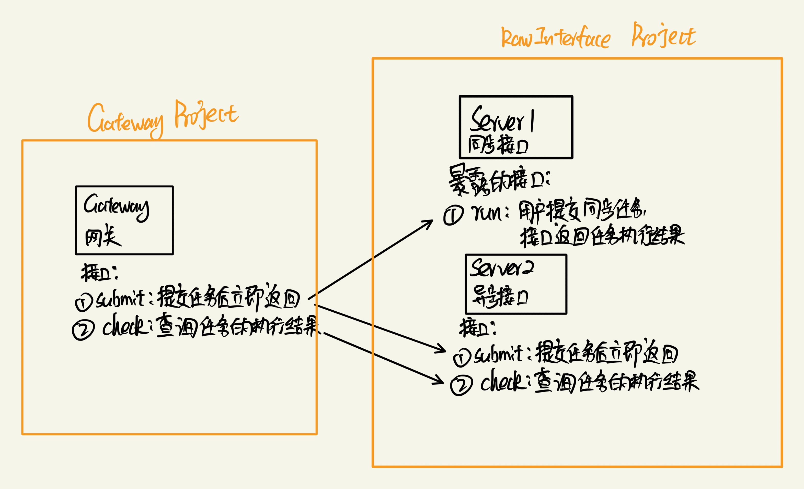

# Gateway（网管模拟实现的接口网关项目）

> Mock API 项目见链接：[Mock API 项目](https://github.com/shaojunying/RawInterface)

## 背景

假设现有一系列接口，这些接口有些是同步的，有些是异步的，我们需要编写一个网关层，将这些江口统一暴露成异步接口。

### 架构图

## 项目内容

当前项目（Gateway）实现的是左侧大方框圈出的部分，即网关层，网关层的作用是将原有的接口统一暴露成异步接口。

### 暴露API

- /task/submit (POST) 提交任务，立即返回
- /task/check (GET) 检查任务的执行状态，返回任务执行结果

### 实现

#### 同步接口

- submit 接口，启动一个线程，调用同步接口，同步接口执行完毕后，将结果写入到数据库中
- check 接口，从数据库中查询任务的执行结果，如果任务执行完毕，则返回结果，否则返回运行中

#### 异步接口

- submit 接口，直接调用异步接口的submit接口
- check 接口，直接调用异步接口的check接口
